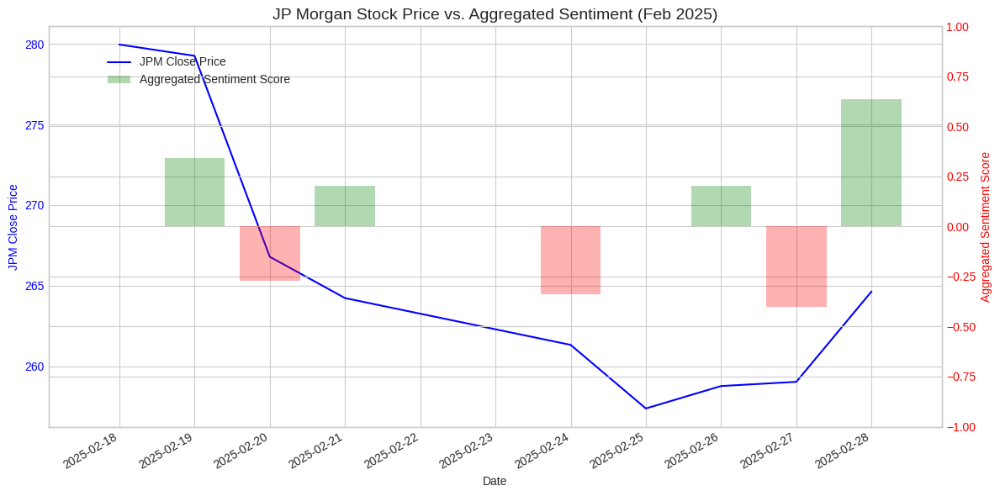

# News Sentiment vs. Price — JPMorgan (JPM)

A compact exploration of whether daily news-headline sentiment tracks short-term price movement in a single large-cap bank stock. Headlines are scraped, scored with VADER, aggregated to a daily sentiment series, and plotted against JPMorgan's daily close.

> **Scope note:** This is an exploratory study, not a predictive model. It visualizes the relationship between sentiment and price over a short window; it does **not** establish a statistical link, and no trading signal is implied.

---

## What it does

- Scrapes recent JPM news headlines from Finviz
- Cleans and tokenizes headline text (NLTK) and scores each headline with **VADER** (compound score, −1 to +1)
- Aggregates headline scores into a **daily mean sentiment** series
- Pulls JPM daily OHLCV via `yfinance`
- Merges price and sentiment on date and produces two visuals:
  - Distribution of headline-level sentiment scores
  - Dual-axis chart: JPM close price vs. daily aggregated sentiment (Feb 2025)

---

## Example output

*JPM daily close (line) against daily mean headline sentiment (bars), Feb 2025. Illustrative only — the window is too short and no statistical relationship was tested.*

---

## Key methods

| Component | Approach |
| --- | --- |
| Headline source | Finviz quote page, parsed with BeautifulSoup |
| Sentiment engine | VADER (`vaderSentiment`) compound score |
| Text preprocessing | NLTK tokenization + English stopword removal |
| Price data | `yfinance` daily bars |
| Aggregation | Mean headline sentiment per calendar day |
| Visualization | matplotlib (histogram + dual-axis time series) |

---

## Tech stack

| Layer | Tools |
| --- | --- |
| Language | Python 3 |
| Data | yfinance, requests, BeautifulSoup |
| NLP | vaderSentiment, NLTK |
| Plotting | matplotlib |

---

## Data & limitations

This project is deliberately small and has real constraints worth stating plainly:

- **Short window.** The overlapping price-and-sentiment sample is roughly two weeks of trading days (February 2025). That is far too little data to support any claim about a relationship between sentiment and returns.
- **Generic sentiment lexicon.** VADER is a general-purpose social-media lexicon, not tuned for financial language. Finance-specific dictionaries (e.g. Loughran-McDonald) would classify terms like "liability" or "volatile" more appropriately.
- **No statistical test.** The output is a visual comparison only. No correlation, regression, or lead-lag analysis was performed, so no relationship is established.
- **Fragile scraping.** Finviz page structure can change and rate-limit; the scraper may need adjustment to re-run.
- **Single name.** One ticker over one month is a demonstration of method, not a generalizable result.

A natural next step would be a longer multi-name sample, a finance-tuned sentiment model, and a formal lead-lag or event-study test.

---

## How to run

1. Open the notebook in Google Colab (or Jupyter).
2. Run the first cell to install dependencies (`yfinance`, `vaderSentiment`, `nltk`, `beautifulsoup4`, etc.).
3. Run cells top to bottom. The notebook downloads NLTK data, scrapes headlines, scores sentiment, and renders the charts inline.

No API keys are required.
